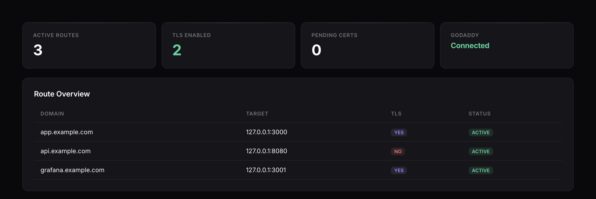
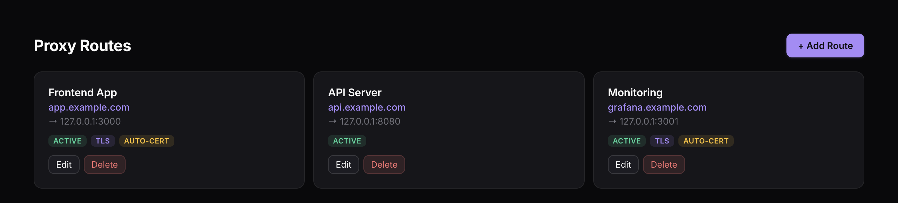

# ProxyGate

[](https://github.com/gcis/proxygate/actions/workflows/ci.yml)
[](https://gcis.github.io/proxygate/)

A lightweight, self-hosted reverse proxy with a built-in web UI for managing routes, TLS certificates (Let's Encrypt), and DNS records (GoDaddy).

## Documentation

Full docs: <https://gcis.github.io/proxygate/>

> **DISCLAIMER: This software is provided for educational and development purposes. It has not been through a formal security audit. Do not use in production environments without thorough review. See [Security Considerations](#security-considerations).**

## Features

- **Reverse Proxy** — Route HTTP/HTTPS/WebSocket traffic by domain name to local services
- **Web Dashboard** — Manage everything through a clean, modern UI
- **Let's Encrypt Integration** — Request free TLS certificates via DNS-01 challenge with step-by-step UI guidance
- **GoDaddy DNS Management** — Create/manage DNS records directly from the UI with API key integration
- **Automatic DNS + Cert** — One-click: create DNS record via GoDaddy, verify, and install certificate
- **Live Reload** — WebSocket-powered real-time updates across all UI components
- **Hot Config Reload** — Change routes without restarting the proxy
- **Admin Network Whitelist** — Restrict admin UI access by IP/CIDR, configurable via CLI or UI
- **Single Binary** — No external dependencies, UI embedded in the Go binary

## Screenshots

| Dashboard | Route Management |
|-----------|-----------------|
|  |  |

## Quick Start

### Build and Run

```bash
git clone https://github.com/gcis/proxygate.git
cd proxygate
make build
./bin/proxygate
```

The admin UI will be available at `http://127.0.0.1:9090`.

### With Network Whitelist

Restrict admin UI access to specific networks from the command line:

```bash
./bin/proxygate --allow-network 192.168.1.0/24 --allow-network 10.0.0.0/8
```

The flag can be repeated. If omitted, the admin UI defaults to localhost only (`127.0.0.0/8`, `::1/128`). Networks can also be configured in the JSON config or through the Settings page in the UI.

### Using Go directly

```bash
go run ./cmd/proxygate/
```

### Configuration

ProxyGate uses a JSON configuration file (default: `./data/proxygate.json`). It's created automatically on first run with sensible defaults:

```bash
./bin/proxygate --config /path/to/config.json
```

Default ports (new install):
| Service | Port | Description |
|---------|------|-------------|
| HTTP Proxy | 8080 | Incoming HTTP traffic (change to 80 in config for production) |
| HTTPS Proxy | 8443 | Incoming HTTPS traffic (change to 443 in config for production) |
| Admin UI | 9090 | Management dashboard (localhost only) |

> Ports 80 and 443 require `CAP_NET_BIND_SERVICE`. See **[docs/deployment.md](docs/deployment.md)** for the recommended approaches (systemd `AmbientCapabilities`, `setcap`, reverse proxy, or container capabilities).

## Usage Guide

### 1. Adding a Proxy Route

1. Open the Admin UI at `http://127.0.0.1:9090`
2. Navigate to **Proxy Routes**
3. Click **+ Add Route**
4. Fill in:
   - **Domain**: The hostname to match (e.g., `app.example.com`)
   - **Target Host**: Where to forward traffic (e.g., `127.0.0.1`)
   - **Target Port**: The port of your local service (e.g., `3000`)
5. Click **Save**

The route is active immediately — no restart needed.

### 2. Setting Up Let's Encrypt TLS

1. Go to **Settings** and configure your ACME email
2. Navigate to **Certificates**
3. Enter your domain and click **Request Certificate**
4. You'll see a DNS TXT record to create:
   - **Name**: `_acme-challenge.yourdomain.com`
   - **Value**: A verification token
5. Create this record with your DNS provider (or use auto-DNS with GoDaddy)
6. Click **Verify & Complete**
7. The certificate is automatically installed and the route is updated

### 3. GoDaddy DNS Integration

1. Go to **DNS Management**
2. Enter your GoDaddy API Key and Secret ([get them here](https://developer.godaddy.com/keys))
3. Click **Test Connection** to verify
4. You can now:
   - Browse your domains and DNS records
   - Create A, CNAME, and TXT records from the UI
   - Enable **Auto-DNS** when requesting certificates for automatic record creation

### 4. Automatic Certificate Flow

With GoDaddy configured, the entire certificate flow is automated:

1. Request a certificate for a domain
2. Check **Auto-create DNS record via GoDaddy**
3. Click **Request Certificate** → the DNS record is created automatically
4. Click **Verify & Complete** → certificate is fetched and installed
5. The proxy route is updated with TLS — all automatically

## Architecture

```
┌─────────────────────────────────────────┐
│                ProxyGate                │
├─────────────┬─────────────┬─────────────┤
│  HTTP :80   │ HTTPS :443  │ Admin :9090 │
├─────────────┴─────────────┤             │
│     Reverse Proxy Engine  │  REST API   │
│  ┌──────┐ ┌──────┐       │  WebSocket  │
│  │Route1│ │Route2│ ...   │  Static UI  │
│  └──┬───┘ └──┬───┘       │             │
│     ▼        ▼            │             │
│  :3000    :8080    ...   │             │
├───────────────────────────┤             │
│  Config Manager (hot reload)            │
│  ACME Client (Let's Encrypt)            │
│  GoDaddy DNS Client                     │
└─────────────────────────────────────────┘
```

## Configuration Reference

```json
{
  "server": {
    "http_port": 8080,
    "https_port": 8443,
    "admin_port": 9090,
    "admin_host": "127.0.0.1",
    "allowed_networks": ["127.0.0.0/8", "::1/128"]
  },
  "routes": [
    {
      "id": "route_1",
      "name": "My App",
      "domain": "app.example.com",
      "target_host": "127.0.0.1",
      "target_port": 3000,
      "tls_enabled": false,
      "enabled": true
    }
  ],
  "godaddy": {
    "api_key": "",
    "api_secret": "",
    "base_url": "https://api.godaddy.com"
  },
  "acme": {
    "email": "admin@example.com",
    "directory": "https://acme-v02.api.letsencrypt.org/directory",
    "cert_dir": "./certs",
    "use_staging": true
  }
}
```

## Deployment

For full production deployment instructions — systemd with `AmbientCapabilities`,
`setcap`, reverse proxy (nginx/Caddy), and container (Docker/k8s) options — see
**[docs/deployment.md](docs/deployment.md)**.

### Quick systemd install

```bash
# Build
make build

# Install binary and create service user
sudo cp bin/proxygate /opt/proxygate/proxygate
sudo useradd --system --no-create-home --shell /usr/sbin/nologin proxygate
sudo mkdir -p /opt/proxygate/{data,certs}
sudo chown -R proxygate:proxygate /opt/proxygate

# Install unit file (already has AmbientCapabilities=CAP_NET_BIND_SERVICE)
sudo cp examples/systemd/proxygate.service /etc/systemd/system/
sudo systemctl daemon-reload
sudo systemctl enable --now proxygate
```

The unit file runs ProxyGate as the `proxygate` user with `CAP_NET_BIND_SERVICE`,
so it can bind ports 80/443 **without root**.

### Running on Port 80/443 without systemd

```bash
sudo setcap 'cap_net_bind_service=+ep' ./bin/proxygate
```

**Re-run `setcap` after every build** — capabilities are stored on the binary file,
not in source. See [docs/deployment.md](docs/deployment.md) for details.

## Security Considerations

> **WARNING: This software is NOT production-ready without a security audit.**

Known considerations:

- **Admin UI** binds to `127.0.0.1` by default — do NOT expose to the internet
- **GoDaddy API credentials** are stored in the config file — protect file permissions
- **ACME account key** is stored on disk — back up and protect `certs/account.key`
- **No authentication** on the admin UI — it relies on being localhost-only
- **TLS configuration** uses modern cipher suites but has not been formally audited
- **Input validation** is basic — do not trust user input from untrusted networks
- **No rate limiting** on the admin API

For production use, consider:
- Adding authentication to the admin UI
- Encrypting the config file or using a secrets manager
- Running behind a hardened reverse proxy (nginx, Caddy) for the admin interface
- Regular security audits and dependency updates
- Network-level access controls

## API Reference

All endpoints are prefixed with `/api`.

| Method | Path | Description |
|--------|------|-------------|
| GET | `/api/config` | Get current configuration |
| PUT | `/api/config/server` | Update server config |
| GET | `/api/routes` | List all routes |
| POST | `/api/routes` | Create a route |
| GET | `/api/routes/{id}` | Get a specific route |
| PUT | `/api/routes/{id}` | Update a route |
| DELETE | `/api/routes/{id}` | Delete a route |
| GET | `/api/status` | Get proxy status |
| POST | `/api/acme/request` | Request a certificate |
| POST | `/api/acme/complete` | Complete certificate verification |
| GET | `/api/acme/challenges` | List active ACME challenges |
| PUT | `/api/acme/config` | Update ACME settings |
| PUT | `/api/godaddy/config` | Update GoDaddy credentials |
| POST | `/api/godaddy/verify` | Test GoDaddy connection |
| GET | `/api/godaddy/domains` | List GoDaddy domains |
| GET | `/api/godaddy/domains/{d}/records` | List DNS records |
| POST | `/api/godaddy/domains/{d}/records` | Create DNS record |
| DELETE | `/api/godaddy/domains/{d}/records/{type}/{name}` | Delete DNS record |
| POST | `/api/godaddy/auto-dns` | Auto-create DNS record |
| GET | `/ws` | WebSocket for live updates |

## License

MIT License. See [LICENSE](LICENSE) for details.
